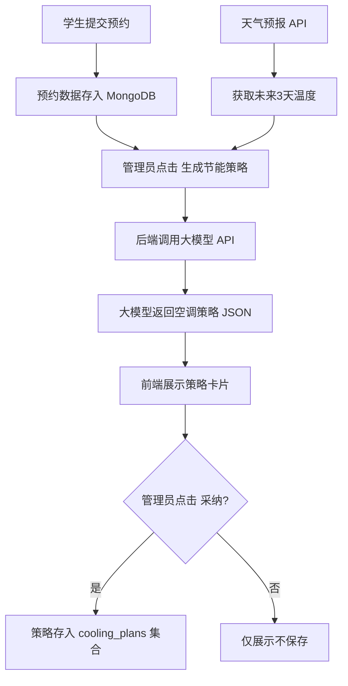

## 1. 产品概述
无人值守自习室智能空调节能与座位预约管理系统——通过将座位预约数据与天气预报信息结合，借助大语言模型生成各房间空调定时开关及温度设定建议，实现精细化节能管控。
- 解决无人自习室空调能耗高、人工调节不及时的问题
- 目标用户：自习室运营管理者

## 2. 核心功能

### 2.1 用户角色
| 角色 | 注册方式 | 核心权限 |
|------|----------|----------|
| 管理员 | 后台预设账号 | 管理预约、查看看板、生成/采纳节能策略 |
| 学生 | 微信/手机号注册 | 浏览座位、提交预约 |

### 2.2 功能模块
1. **预约看板页面**：实时展示各房间座位预约状态，支持按日期/房间筛选
2. **AI 节能建议页面**：调用大模型生成空调策略、展示策略卡片、采纳策略并存入数据库

### 2.3 页面详情
| 页面名称 | 模块名称 | 功能描述 |
|----------|----------|----------|
| 预约看板 | 日期选择器 | 切换查看不同日期的预约情况 |
| 预约看板 | 房间座位图 | 以房间为维度展示座位网格，已预约/空闲状态一目了然 |
| 预约看板 | 预约统计卡片 | 显示当日各房间预约人数、总预约数 |
| AI 节能建议 | 天气预报面板 | 展示未来 3 天天气温度信息 |
| AI 节能建议 | 预约概览面板 | 展示未来 3 天各房间预约人数统计 |
| AI 节能建议 | 生成策略按钮 | 触发调用大模型 API 生成节能策略 |
| AI 节能建议 | 策略卡片列表 | 以卡片形式展示每个房间的空调开关时间与温度建议 |
| AI 节能建议 | 采纳按钮 | 将当前策略保存至 cooling_plans 集合 |
| AI 节能建议 | 历史策略列表 | 展示已采纳的历史策略记录 |

## 3. 核心流程

1. 学生提交座位预约 → 预约数据写入 MongoDB
2. 管理员打开 AI 节能建议页面 → 系统自动加载未来 3 天预约人数 + 天气数据
3. 管理员点击"生成节能策略" → 后端将预约人数与天气温度传入大模型 API
4. 大模型返回 JSON 数组（各房间空调开关时间+温度设定） → 前端以卡片展示
5. 管理员点击"采纳" → 策略写入 cooling_plans 集合

## 4. 用户界面设计

### 4.1 设计风格
- 主色调：深青绿 (#0D9488) + 暖橙点缀 (#F97316)
- 按钮风格：圆角 (8px)、悬停微阴影
- 字体：Noto Sans SC（中文）+ DM Sans（数字/英文）
- 布局风格：左侧导航栏 + 右侧内容区，卡片式布局
- 图标风格：Material Icons 线性风格

### 4.2 页面设计概览
| 页面名称 | 模块名称 | UI 元素 |
|----------|----------|---------|
| 预约看板 | 日期选择器 | 横向日期滑动选择器，当前日期高亮 |
| 预约看板 | 房间座位图 | 网格卡片，绿色=空闲，橙色=已预约，灰色=维护中 |
| 预约看板 | 预约统计卡片 | 数字卡片 + 小趋势图标 |
| AI 节能建议 | 天气面板 | 三列天气卡片（日期+温度+图标） |
| AI 节能建议 | 预约概览 | 柱状图/数字展示各房间预约数 |
| AI 节能建议 | 生成策略按钮 | 大号主色按钮，loading 动画 |
| AI 节能建议 | 策略卡片 | 房间名 + 时间段 + 温度设定，右侧采纳按钮 |
| AI 节能建议 | 历史策略 | 时间线列表，可展开查看详情 |

### 4.3 响应式
- 桌面优先设计，平板/手机自适应
- 卡片在小屏幕下纵向堆叠
