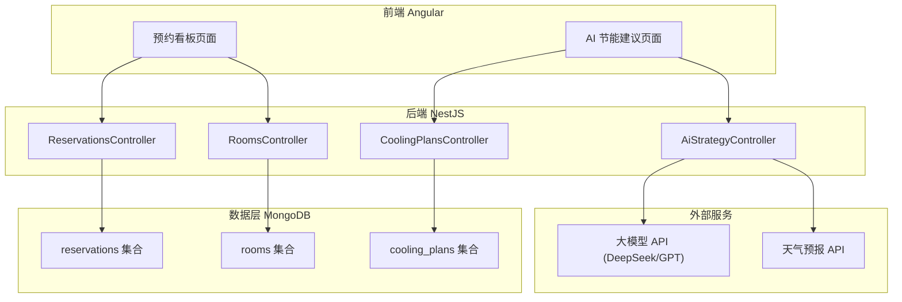
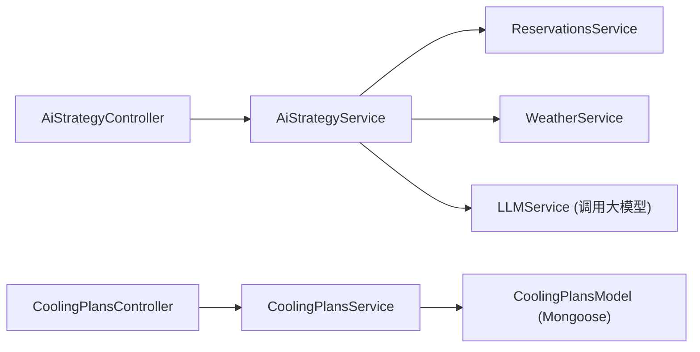
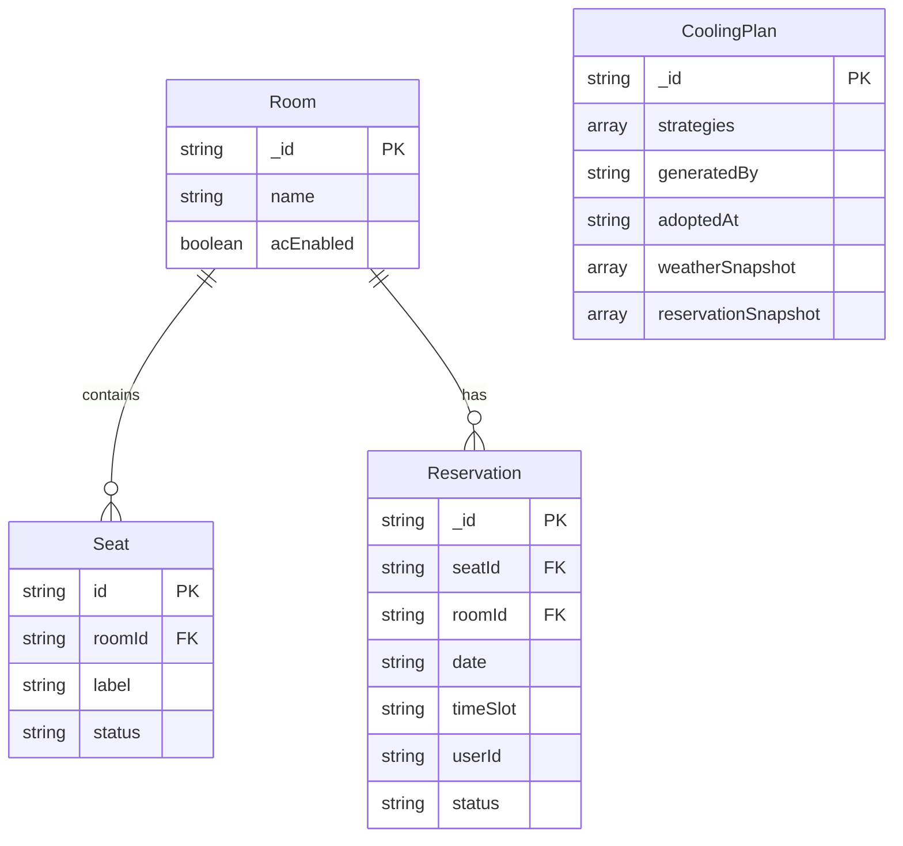

## 1. 架构设计



## 2. 技术说明
- 前端：Angular 17 + TypeScript + SCSS + Angular Material
- 后端：NestJS + TypeScript + Mongoose (ODM)
- 数据库：MongoDB
- 外部 API：DeepSeek API（大模型）、Open-Meteo API（免费天气预报）
- 包管理器：npm

## 3. 路由定义
| 路由 | 用途 |
|------|------|
| `/` | 重定向到预约看板 |
| `/reservations` | 预约看板页面 |
| `/ai-savings` | AI 节能建议页面 |

## 4. API 定义

### 4.1 预约相关
```
GET    /api/reservations?date=YYYY-MM-DD    获取指定日期预约列表
POST   /api/reservations                     创建预约
DELETE /api/reservations/:id                 取消预约
```

### 4.2 房间相关
```
GET /api/rooms                               获取所有房间及座位信息
```

### 4.3 AI 节能策略
```
POST /api/ai-strategy/generate               生成节能策略（调用大模型）
  Request Body: { reservations: [...], weather: [...] }
  Response: { strategies: [{ room, schedule, temperature, reasoning }] }

GET  /api/cooling-plans                      获取已采纳的策略列表
POST /api/cooling-plans                      采纳策略（存入 cooling_plans）
  Request Body: { strategies: [...], generatedBy: "AI", adoptedAt: ISODate }
```

### 4.4 天气相关
```
GET /api/weather?days=3                      获取未来3天天气预报
```

### 4.5 TypeScript 类型定义
```typescript
interface Reservation {
  _id: string;
  seatId: string;
  roomId: string;
  date: string;
  timeSlot: string;
  userId: string;
  status: 'confirmed' | 'cancelled';
}

interface Room {
  _id: string;
  name: string;
  seats: Seat[];
  acEnabled: boolean;
}

interface Seat {
  id: string;
  label: string;
  status: 'available' | 'occupied' | 'maintenance';
}

interface WeatherInfo {
  date: string;
  tempMax: number;
  tempMin: number;
  description: string;
}

interface CoolingStrategy {
  room: string;
  schedule: { on: string; off: string };
  temperature: number;
  reasoning: string;
}

interface CoolingPlan {
  _id: string;
  strategies: CoolingStrategy[];
  generatedBy: string;
  adoptedAt: string;
  weatherSnapshot: WeatherInfo[];
  reservationSnapshot: { date: string; room: string; count: number }[];
}
```

## 5. 服务端架构图



## 6. 数据模型

### 6.1 数据模型定义



### 6.2 数据定义语言

#### rooms 集合
```json
{
  "_id": "ObjectId",
  "name": "A101",
  "acEnabled": true,
  "seats": [
    { "id": "A101-01", "label": "A1", "status": "available" },
    { "id": "A101-02", "label": "A2", "status": "available" }
  ]
}
```

#### reservations 集合
```json
{
  "_id": "ObjectId",
  "seatId": "A101-01",
  "roomId": "ObjectId(Room)",
  "date": "2026-06-22",
  "timeSlot": "09:00-12:00",
  "userId": "user_001",
  "status": "confirmed"
}
```

#### cooling_plans 集合
```json
{
  "_id": "ObjectId",
  "strategies": [
    {
      "room": "A101",
      "schedule": { "on": "08:30", "off": "12:00" },
      "temperature": 26,
      "reasoning": "上午预约人数较多，建议提前开启"
    }
  ],
  "generatedBy": "DeepSeek",
  "adoptedAt": "2026-06-22T10:00:00Z",
  "weatherSnapshot": [
    { "date": "2026-06-22", "tempMax": 35, "tempMin": 26, "description": "晴" }
  ],
  "reservationSnapshot": [
    { "date": "2026-06-22", "room": "A101", "count": 8 }
  ]
}
```
